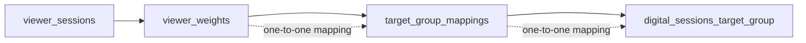
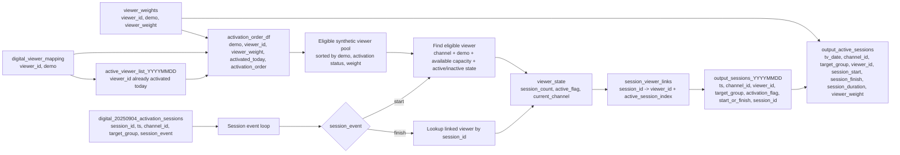

# Data Model

## Target Group Relationship: viewer_sessions -> viewer_weights -> target_group_mappings -> digital_sessions_target_group

## Interpretation

This relationship describes a strict lineage of demographic and weighting logic:

- Each record in `viewer_sessions` is associated with a corresponding weight in `viewer_weights`.
- That weight is then mapped through `target_group_mappings` to a target-group definition.
- That target-group definition corresponds to a single record in `digital_sessions_target_group`.
- The key assumption is that this path is effectively a one-to-one map rather than a many-to-many relationship.

## Business meaning

- `viewer_sessions` captures the observed session-level behavior of synthetic viewers.
- `viewer_weights` stores the representational weight needed to scale or activate synthetic viewers.
- `target_group_mappings` aligns those viewers to demographic or target-group buckets.
- `digital_sessions_target_group` is the digital equivalent used to compare or match digital sessions against the synthetic viewer structure.

## Why it matters

This structure ensures that demographic assignment, weighting, and session representation remain consistent across the synthetic and digital layers. It allows the model to preserve comparability for KPIs while enforcing that each synthetic viewer or mapped unit belongs to exactly one relevant demographic target group at each stage.

## Digital-Session-to-Viewer Linking and Activation Logic 

### output_active_sessions_(date)

Changelog of session linking. Tracking linking to a viewer_id session session start and finish, activation, and deactivation to a viewer_id

### output_active_sessions
Pivoted transformation of output_active_sessions_(date) to match viewer_sessions table structure. Organized around
**(channel_id, viewer_id, session_start, session_finish)**

## DQ Checks

### Assignment Coverage

Measures how much of the digital session inventory is successfully assigned to a synthetic viewer.
Usually expressed as a % of sessions or impressions that have a valid viewer match.

### Concurrent Weighted Viewers

Measures how many synthetic viewers are active at the same time, scaled by viewer weight.
This is the “audience concurrency” metric: not just count of active viewers, but weighted audience size.

### Total Time Watched

Measures cumulative watch time across all assigned sessions.
Typically aggregated as hours/minutes/seconds, often weighted by viewer_weight to reflect total representational viewing.

### Viewer Integrity Raw

Check for over/under capacity assignments and improper activation/deactivation. Uses unpivoted **output_sessions_(date)** since the output table doesn't record enough detail.

### Viewer Integrity - Final Table

Straightforward check that **output_active_sessions** doesn't have overlapping sessions.

### Demographic Consistency

Check that target_group buckets are consistent based on digital session_id.